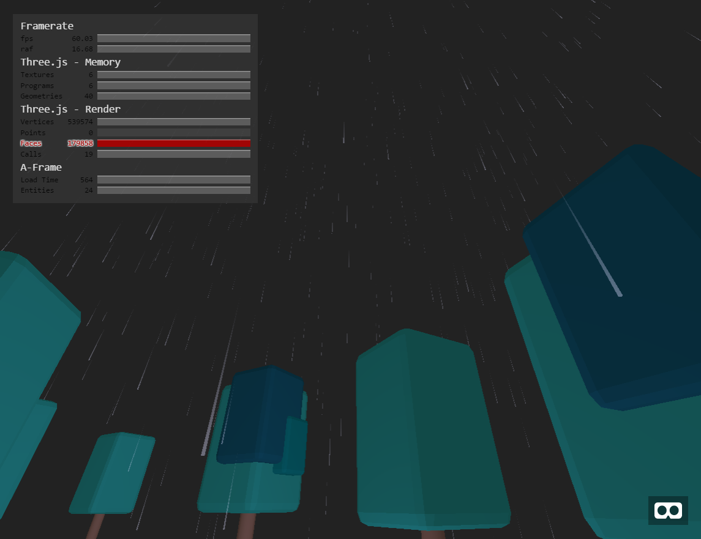

# A-Frame Rain component

aframe-rain is Rainfall effect component for A-Frame which displays a lot of
rain drop/splash objects by using instancing technique with good performance.



Closer rain drop height is shorter and further rain drop is more transparent,
implemented similar to Fog effect technique.

## Demo

[Demo](https://cdn.rawgit.com/takahirox/aframe-rain/v1.0.1/index.html)

## Properties

### aframe-rain

| Properties    | type    | Default Value | Description |
| ------------- | ------- | ------------- | ----------- |
| color         | color   | '#ddf'        | Rain drop/splash color |
| count         | int     | 5000          | The number of drops/splashes |
| depthDensity  | number  | 0.05          | Depth density which affects rain drop height/opacity. The name is from Fog density |
| dropHeight    | number  | 1.0           | Rain drop height |
| dropRadius    | number  | 0.005         | Rain drop radius |
| height        | number  | 30.0          | How high rain drops fall from |
| opacity       | number  | 0.4           | Rain drop/splash opacity |
| splash        | boolean | true          | If displays rain splash on ground |
| splashBounce  | number  | 4.0           | Rain splash bound strongness |
| splashGravity | number  | 9.8 * 4.0     | Rain splash gravity |
| vector        | vec3    | '0, -40.0 0'  | Rain drop vector. y must be < 0.0 |
| width         | number  | 30.0          | Area where rain drop/sphash effect |

## Browser

### How to use

To apply Rain effect in a scene, add `rain` attribute in `<a-scene>` like `<a-scene rain>`.

```html
<head>
  <script src="https://cdn.rawgit.com/aframevr/aframe/v0.4.0/dist/aframe-master.min.js"></script>
  <script src="https://rawgit.com/takahirox/aframe-rain/master/build/aframe-rain.min.js"></script>
</head>

<body>
  <a-scene rain>
    <a-entity position="0 0 10">
      <a-camera></a-camera>
    </a-entity>

    <a-entity geometry="primitive:sphere"></a-entity>

    <a-sky color="#222"></a-sky>

    <a-entity light="type:directional;color:#666" position="-10 -10 -10"></a-entity>
  </a-scene>
</body>
```

## NPM

### How to install

```
$ npm install aframe-rain
```

### How to build

```
$ npm install
$ npm run all
```

### How to load

```
require('aframe');
require('aframe-rain');
```